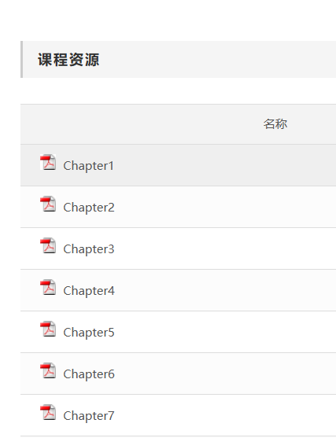
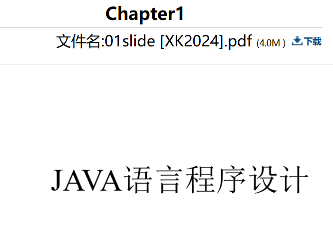

一共有两个需要获取的头文件，
网站：https://curlconverter.com/
第一个是课件列表所在页面

可以输入课件名字找到文件https://eonline.jw.scut.edu.cn/meol/common/script/listview.jsp?acttype=enter&folderid=175036&lid=33648
记得复制bash
第二个是点进去文件的预览页面

可以输入课件名找到文件https://eonline.jw.scut.edu.cn/meol/common/script/preview/download_preview.jsp?fileid=1908215&resid=175037&lid=33648

代码最后一段保存下来的文件会出现问题（在issue中已经提到），可以通过点击打印出来的最终download的url下载文件